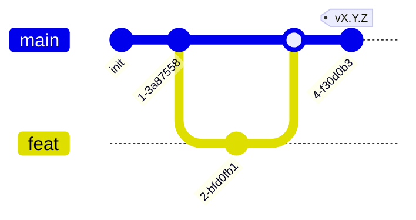

# AGENTS.md — правила работы в хаб-репозитории

Точка входа для людей и AI-агентов в **репозитории хаба** CyberCity. Хаб хранит
системные контракты: `COMPOSITION.md` (состав программы — edge-реестр),
`CONVENTIONS.md` (event envelope, кросс-сервисные конвенции общения; версионируется
`@vN`), системный `docker-compose.yml`, `adr/`. Кода здесь нет.

> **Что это за репо.** Хаб — корневой узел программы в edge-модели верификации:
> активно ребро **вниз** (`хаб → все сервисы` + `хаб → интерфейсы` + `хаб →
> stub-таргеты`) — все дети проверяются на соответствие хабу на пиннённой версии
> контрактов; и ребро **вверх** (`методология → хаб`) — хаб соответствует
> методологии. См. `<methodology-repo>/docs/refs/VERIFICATION.md`.

> Методология —
> [`TheCipherKeeper/ai-project-template`](https://github.com/TheCipherKeeper/ai-project-template)
> (далее `<methodology-repo>`): процедуры `docs/guide/`, факты `docs/refs/`,
> стартовые наборы `skeletons/{service,interface,stub}/`. Правила читаются из
> методологии, **не копируются** в хаб/сервисы/интерфейсы/stub-таргеты.

## Документация (приоритет)

В порядке убывания **по ярусам**: методология (`<methodology-repo>/docs/`, где
`guide/` и `refs/` — **равные**, разные виды) → этот `AGENTS.md` →
`COMPOSITION.md` / `CONVENTIONS.md` / `adr/` → (кода в хабе нет).

Приоритет арбитражирует **только между ярусами** (например, `AGENTS.md`
запрещает то, что `COMPOSITION` подразумевает — запрет побеждает; `CONVENTIONS@vN`
бьёт устаревший код сервиса на пине). Противоречие **внутри яруса** (в частности,
`COMPOSITION` против `CONVENTIONS`) — **дефект** (чинят к одной правде либо
заводят ADR), а не «старший побеждает».

## Модель ветвления



- `main` — стабильная, единственная интеграция. Вливается из feature-веток
  через PR.
- `feat/<задача>` — от `main`, удаляется после merge.
- Прямой коммит в `main` — **запрещён**. Только feature-ветка + PR.
- Релизы — тегами `vX.Y.Z` на `main`; release-ветки не заводятся. Процедура —
  `<methodology-repo>/docs/guide/70-release.md`.

## Что можно

- Редактировать `COMPOSITION.md` (состав программы — добавлять/удалять сервисы,
  интерфейсы, stub-таргеты; секции «Интерфейсы»/«Stub-таргеты» — для рёбер
  `хаб → интерфейс` / `хаб → stub`).
- Редактировать `CONVENTIONS.md` (event envelope, конвенции общения) — с
  версионированием (`@vN`); bump major — отдельным PR + координированный апдейт
  сервисов.
- Менять системный `docker-compose.yml` (все сервисы + брокер).
- Заводить ADR в `adr/` (хаб — единый ADR-дом программы; см. ADR-0005).
- Создавать feature-ветки, PR в `main`, теги.

## Что нельзя

- Коммитить напрямую в `main`; заводить `dev`/release-ветки.
- Менять контракт `CONVENTIONS@vN` задним числом (уже выпущенная версия
  неизменна; новое — `@vN+1`). Иначе сервисы на пине `@vN` ломаются.
- Хранить здесь код сервисов/интерфейсов/stub-таргетов или их рабочие артефакты
  (`ARCHITECTURE.md`/`BACKLOG.md`/`specs/`/`Dockerfile` сервисов) — это в их репо.
- Вводить прямую **service-to-service** связность в обход брокера в
  `COMPOSITION`/`CONVENTIONS` — общение сервисов только через брокер
  (`<methodology-repo>/docs/refs/COMMUNICATION.md`). (Интерфейс → сервис по
  HTTP/WS — разрешено; stub-таргет — не участник брокера, наблюдается out-of-band.)
- Дублировать факты (один факт — один авторитет: состав/контракты/пины —
  `COMPOSITION`; envelope/конвенции общения — `CONVENTIONS`; решения — `adr/`).
- Коммитить `.env`/секреты; трогать lock-файлы без одобрения.
- Выдавать stub/placeholder за реализацию — честно помечать TODO.

## Версионирование контрактов (обязательно)

- `CONVENTIONS.md` экспонирует версии: `CONVENTIONS@v1`, `@v2`, …
- Сервисы пинят версию; гейт проверяет сервис против пина, не HEAD
  (`<methodology-repo>/docs/refs/VERIFICATION.md`).
- Breaking change в `CONVENTIONS` → bump major (`@vN+1`) отдельным PR; сервисы
  мигрируют каждый своим PR (бамп пина + правки). Не атомарно — потому и нужен
  pin. Stub-таргетам `CONVENTIONS@vN` N/A (не потребляют envelope).

## ADR-формат

- Отдельный файл `adr/NNNN-kebab-case.md` (все ADR — в хабе, нумерация сквозная;
  см. ADR-0005). С ведущими нулями.
- Заголовки: `# ADR-NNNN: <title>`, `## Status`, `## Scope`, `## Context`,
  `## Decision`, `## Consequences`, `## Alternatives considered`, `## Related`.
- `## Scope` — чему относится решение: `Сквозное` либо репозиторий(и)
  (`engine`, `data`, …). Поле нужно, потому что локальные ADR репозиториев живут
  в общем каталоге и должны быть различимы.
- `Status`: `Accepted` | `Proposed` | `Superseded` (со ссылкой на заменивший) |
  `Amended` (со ссылкой). Старые решения помечаем `Superseded`, **не удаляем**.
- `adr/README.md` — индекс: номер, scope, заголовок, статус, ссылка.
- Шаблон — [`adr/_TEMPLATE.md`](adr/_TEMPLATE.md).

## Нейминг

- Репозитории: `cybercity-<слайс>` (`cybercity-data`, `cybercity-engine`, …);
  хаб — `cybercity` (обложка).
- Идентификаторы сущностей — kebab-case (`bank-web`, `hospital-db`).
- Топология: `id`, `org_id`, `network_id` — kebab-case; IP/CIDR — аллокатором из
  `cybercity-data`, воспроизводимо через `--seed`.
- Crate-имена collector'а: `ccc-*` (cyber city collector); бинарник
  `cybercity-collector`.

## README-контракт хаба

- Три бейджа: `CyberCity-composition` (→ `TheCipherKeeper/cybercity`), MIT,
  CC BY 4.0.
- Краткая сводка (что это, статус) + quick start + навигация по репозиториям.
- Ссылка на `COMPOSITION.md` (канон состава) и `AGENTS.md` (governance).
- **Не** дублирует таблицу состава проекта — только ссылка на `COMPOSITION`.

## Лицензии

- Код: MIT (`LICENSE`).
- Документация: CC BY 4.0 (`LICENSE-DOCS`, 12-строчный deed, в корне).
- Бейджи в README ссылаются на эти файлы.

## Коммиты

Conventional Commits. Scope — `composition`/`conventions`/`deploy`/`adr`/`docs`.

```
feat(conventions): add trace_id to event envelope @v2
fix(composition): register new billing service
docs: link ADR-0010 from COMPOSITION
adr: 0010 data as broker-producer
```

Тело коммита — на русском; summary line — английский допустим. Breaking changes
контракта — `BREAKING CHANGE:` в теле + bump версии. PR: кратко что и зачем,
ссылка на ADR если есть, статус проверок (lint/test/build). Коммиты и пуши делает
агент после явного запроса; человек апрувит. LLM — помощник, не хозяин:
валидаторы, тесты и линтеры решают.

## Язык

Документация и ADR — **русский**. Английский — только для идентификаторов кода,
имён библиотек, `Status:` в ADR (`Accepted`/`Superseded`/`Amended`), технических
заголовков таблиц, summary-строки коммита.