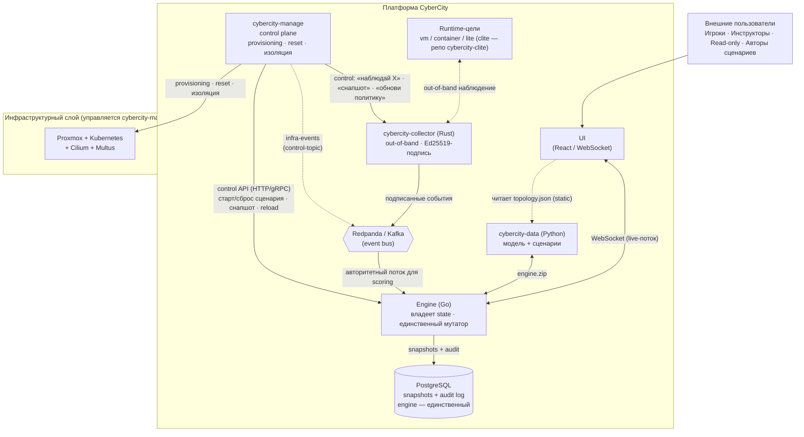
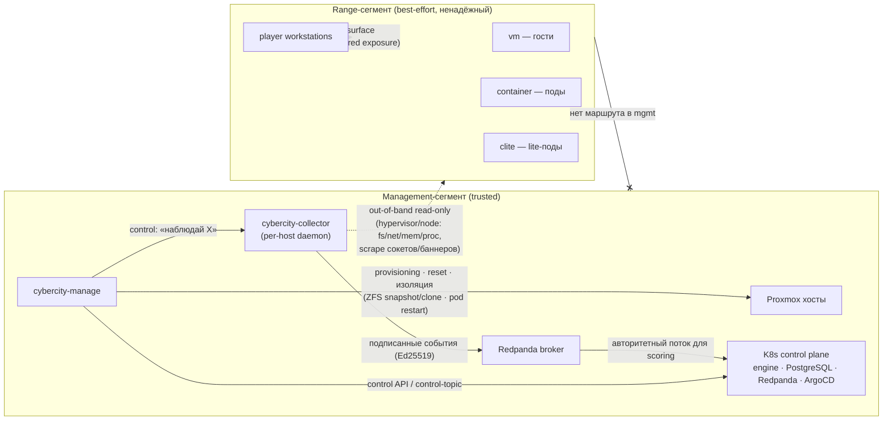

# CyberCity — Архитектура

Системный взгляд: как слои соединены, где что живёт, какие потоки между ними.
Зачем проект существует и принципы — в [`VISION.md`](VISION.md); состав
репозиториев, контракты, доверительная граница и ownership — в
[`COMPOSITION.md`](COMPOSITION.md); runtime-динамика (жизненный цикл события и
сценария, end-to-end потоки) — в [`DATA_FLOW.md`](DATA_FLOW.md). Здесь — только
«как соединено» (статика + сетевая топология).

## Системный контекст

## Основные ответственности

Функция каждого компонента в системе. Границы владения (кто чем владеет, кто
ходит в БД, кто мутатор) — в [`COMPOSITION.md`](COMPOSITION.md)
(§ «Кто чем владеет»).

| Компонент | Функция |
|-----------|---------|
| **cybercity-data** | Декларативная модель города (source of truth), валидация, генерация артефактов (`engine.zip`, `topology.json`, …), авторинг сценариев. |
| **cybercity-engine** | Runtime-состояние, обработка событий, propagation, причинный граф, снапшоты, scoring, исполнение сценариев. |
| **cybercity-ui** | Визуализация (карта, таймлайн, дашборды), ввод игрока, real-time обновления по WebSocket от engine + чтение статичной `topology.json` из data. |
| **cybercity-manage** | Контрольная плоскость: provisioning, reset/rollback, изоляция, квоты/мульти-тенантность; размещает коллектор на хостах; координирует engine через control API + Redpanda. |
| **cybercity-collector** | Внешний out-of-band per-host наблюдатель; подписанные события в engine по Kafka; control-канал от manage. |
| **cybercity-clite** | Параметризуемый stub-образ `clite` для `runtime_kind: lite`: биндит порты, поддельный баннер/поведение по дескриптору сервиса, heartbeat коллектору. |
| **Redpanda / Kafka** | Event bus: подписанные события collector → engine (авторитетный поток для scoring) + control-канал manage → collector/engine. |
| **PostgreSQL** | Снапшоты `WorldState` и audit log событийного графа. |
| **MinIO / S3** | Артефакты `engine.zip` и replay-дампы. |

## Два графа — модель города

Город моделируется через два связанных графа (концепция; поля — в
`cybercity-engine`/docs/MODELS.md):

- **Топологический граф** (статический) — *что с чем связано*. Загружается из
  `cybercity-data`, иммутабелен во время симуляции. Узлы — сервисы, рёбра —
  декларированные связи (`api-call`, `auth`, `db-read`, `backup-of`, …) плюс
  inferred (`same_network`, `same_org`, `exposure_chain`).
- **Событийный граф** (динамический, append-only) — *что произошло и почему*.
  Узлы — события, рёбра — `caused_by`, `propagated_to`, `triggered_rule`,
  `response_to`. Даёт attack provenance, replay, explainability.

Топология — рельсы; события — поезда. Подробно — в
[`cybercity-engine`/docs/ARCHITECTURE.md](https://github.com/TheCipherKeeper/cybercity-engine/blob/main/docs/ARCHITECTURE.md).

## Hybrid execution

| `runtime_kind` | Что это | Кто отвечает на события | Когда используется |
|-------|---|---|----|
| **vm** | полная VM, real OS/software | Out-of-band наблюдатель (`cybercity-collector`) | High-value target, Windows/OT, persistence |
| **container** | контейнер, real software (gVisor/Kata) | Out-of-band наблюдатель | real-сервис на shared-ядре, плотнее VM |
| **lite** | лёгкий stub-контейнер: реальный сокет + подделанный баннер | Out-of-band наблюдатель | Массовый фон города (дешёвый runnable-фон) |

`runtime_kind` — deployment-time concern, не часть канонической city data
(назначается в `cybercity-manage` service-mapping manifest). По умолчанию —
`lite`. Все runtime-цели наблюдаются коллектором единообразно; движок —
регистратор, не симулятор (класса «engine-synthesized service events» нет).
Обоснование —
[`adr/0004-runtime-kind-vm-container-lite.md`](adr/0004-runtime-kind-vm-container-lite.md).

## Слои развёртывания

| Слой | Назначение | Примеры инструментов |
|------|------------|----------------------|
| **Management** | Админский доступ, CI/CD, мониторинг; живут manage + коллектор + Kafka | Proxmox host, Terraform, Ansible |
| **Control** | Движок, БД, messaging, GitOps | K8s, Redpanda, PostgreSQL, ArgoCD |
| **City / Data** | Real VMs, lite stub-контейнеры, player workstations | VMs, Multus, Cilium, VyOS |

## Сетевая топология и сегментация

Физическая реализация доверительной границы (ADR-0002). Два сегмента,
жёстко разделённые; **из range нет маршрута в mgmt-плоскость** (брокер,
`manage`, control-канал коллектора). Это и есть механизм «атакующий не
может подделать поток для scoring».

- **Management-сегмент (trusted):** Proxmox-хосты, K8s control plane (`engine`,
  `PostgreSQL`, `Redpanda`, ArgoCD), `cybercity-manage`, `cybercity-collector`
  (по демону на хост), брокер. Здесь считается scoring.
- **Range-сегмент (best-effort):** гости (`vm`), поды (`container`), stub-поды
  `clite` (`lite`), рабочие станции игроков. Ненадёжная плоскость; in-guest
  телеметрия — best-effort, **никогда** не источник для scoring.
- **Multus** даёт каждому сервису реальный per-service IP в range — поэтому
  `nmap` видит настоящие сокеты по всему городу (включая `lite`).
- **Cilium** реализует сетевые политики = рёбра топологического графа: публичные
  сервисы достижимы только через declared exposure; OT/ICS-сегменты изолированы
  от management и публичных сетей.
- **Направление наблюдения — mgmt → range, read-only:** коллектор наблюдает
  цели снаружи (зонды на гипервизоре/узле + scrape сокетов/баннеров) и
  подписывает события; range ничего не инициирует в mgmt. «Heartbeat» `clite`
  наблюдается коллектором как часть out-of-band scrape, а не пушем в mgmt.
- **Reset/изоляция:** `manage` драйвит гипервизор из mgmt (ZFS snapshot/clone
  для `vm`, restart pod для `container`/`lite`); гость себя сам не сбрасывает.

> Топология — целевая; текущая степень развёртывания — в
> [`COMPOSITION.md`](COMPOSITION.md) (§ «Статус реализации»). Доверительная
> граница как концепция (trusted vs best-effort, кто считает scoring) — там же,
> § «Доверительная граница»; обоснование —
> [`adr/0002-trust-boundary.md`](adr/0002-trust-boundary.md).

## Observability

- **Метрики:** tick duration, queue depth, event throughput, health сервисов.
- **Логи:** structured JSON с `correlation_id` и `event_id`.
- **Трейсы:** lineage событий через событийный граф.
- **Дашборды:** Grafana с city-level и per-service видами.

## Модель безопасности

Доступ и секреты (сетевая сегментация, declared exposure и OT-изоляция — в
§ «Сетевая топология и сегментация»):

- Публичный UI read-only; действия игрока требуют аутентифицированной сессии.
- Секреты в Vault или cloud KMS, никогда в репозиториях.

Доверительная граница (trusted vs best-effort плоскость, кто считает scoring) —
в [`COMPOSITION.md`](COMPOSITION.md) (§ «Доверительная граница»); обоснование — в
[`adr/0002-trust-boundary.md`](adr/0002-trust-boundary.md).

## Целевые показатели масштабируемости

| Ресурс | Home lab | Production-набросок |
|--------|----------|---------------------|
| Сервисы | 300 | 1,000+ |
| Событий/сек | 100 | 10,000+ |
| Игроки | 10 | 100+ |
| Real VMs/контейнеры | 6–10 | 50–100 |
| Latency | <1s на tick | <100ms на событие |

## Дорожная карта к первой публичной демонстрации

1. **Core engine** ✅ — topology, event graph, router, state, API.
2. **Persistence** — PostgreSQL-снапшоты и audit.
3. **Messaging** — интеграция с Redpanda.
4. **Scenario runner** — первый скриптованный сценарий (авторинг в data).
5. **UI** — интерактивный граф, event log, панель команд.
6. **Home lab deployment** — Proxmox + K8s через manage.
7. **clite-образ** — параметризуемая заглушка `lite`-целей (фон города; без него `lite` не runnable).
8. **Public read-only demo** — Cloudflare tunnel.

Текущий статус реализации по репозиториям — в [`COMPOSITION.md`](COMPOSITION.md)
(§ «Статус реализации»).

## Связанные документы

- [`VISION.md`](VISION.md) — зачем проект существует, принципы, аудитории, non-goals.
- [`DATA_FLOW.md`](DATA_FLOW.md) — runtime-динамика: жизненный цикл события и сценария, end-to-end потоки, replay/scoring.
- [`COMPOSITION.md`](COMPOSITION.md) — состав, контракты, доверительная граница, ownership, статус.
- [`CONVENTIONS.md`](CONVENTIONS.md) — кросс-репо конвенции и иерархия документов.
- [`adr/`](adr/) — сквозные архитектурные решения.
- [`cybercity-engine`/docs/ARCHITECTURE.md](https://github.com/TheCipherKeeper/cybercity-engine/blob/main/docs/ARCHITECTURE.md) — внутреннее устройство движка.
- [`cybercity-data`/docs/ARCHITECTURE.md](https://github.com/TheCipherKeeper/cybercity-data/blob/main/docs/ARCHITECTURE.md) — внутреннее устройство data.