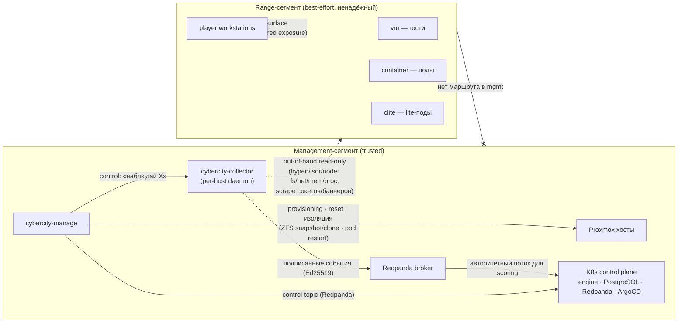
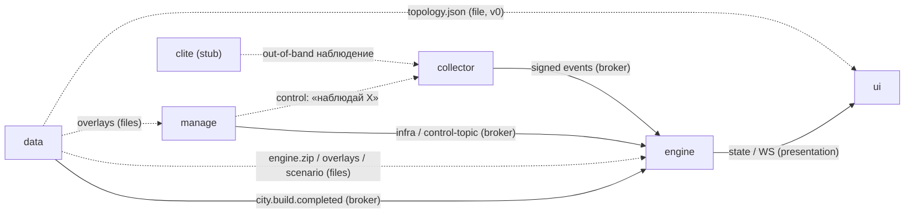

# CyberCity — состав программы

Канонический источник правды о составе проекта: репозитории, контракты,
доверительная граница, ownership, имена, статус реализации. Это **edge-реестр**
для verification «вниз» (`хаб → все сервисы` + `хаб → интерфейсы` + `хаб →
автономные компоненты`): гейт перечисляет детей отсюда. Все репозитории ссылаются сюда;
их `README` держат только короткую сводку + ссылку.

> Методология — в репозитории
> [`TheCipherKeeper/addm`](https://github.com/TheCipherKeeper/addm)
> (далее `<methodology-repo>`): границы и контракты — `docs/ARCHITECTURE.md`,
> рабочий цикл и обязательная проверка — `docs/WORKFLOW.md`, поставка —
> `docs/OPERATIONS.md`. Этот хаб — её инстанция; правила читаются из
> методологии, не копируются.

**CyberCity** — модульный кибер-полигон: цифровой двойник городской ИТ/ОТ-
инфраструктуры для учений red/blue. Город моделируется как ориентированный граф
(организации → сервисы → связи достижимости); декларируется в `cybercity-data`
как код, рендерится в артефакты, исполняется runtime. Не очередная CTF-машинка,
а живой, наблюдаемый, объяснимый город, где инциденты распространяются через
достиимость (каждое падение — наблюдённое коллектором событие), а каждое
изменение состояния имеет записанную причину. Всё крутится на вашем
Proxmox / K8s, без SaaS и внешней телеметрии.

> Это **целевая** композиция. Степень реализации разная по репозиториям
> (см. «Статус реализации»); документ фиксирует договорённости, к которым идёт
> код, а не только то, что уже построено.

## Брокер

- **Брокер:** **Redpanda** (один на систему; Kafka-протокол). Закреплён в
  [ADR-0003](adr/0003-collector-rust-out-of-band.md) (collector → Kafka) и
  системном `docker-compose.yml`.
- **Адрес (система):** из `docker-compose.yml`, сервис `broker` (`broker:9092`).
- **Аутентификация:** mTLS + ACL на продюсеров; гости из range-сегмента до
  брокера не достукиваются структурно (см. «Доверительная граница»).

## Сервисы

> Сервис — клиент брокера; один репо, один стек, деплой контейнером. Версия/хеш —
> закреплённое состояние сервис-репозитория; обязательная проверка хаба
> перечисляет дочерние репозитории отсюда, а каждый сервис проверяется собственным
> CI на закреплённой версии (`<methodology-repo>/docs/ARCHITECTURE.md`).

| Сервис | Репозиторий | Версия/хеш | Роль | Публикует / Читает |
|---|---|---|---|---|
| `gateway` | https://github.com/TheCipherKeeper/cybercity-gateway | v0.0.0 | **сервис-шлюз** (`gateway`, единственный browser-facing API) | читает: `city.state.updated`; публикует: `city.commands`; обслуживает `/v1/*`, `/ws` |
| `engine` | https://github.com/TheCipherKeeper/cybercity-engine | 54cfc60 | событийное ядро: топологический + причинный граф, tick-loop, replay, scoring; единственный мутатор world-state | читает: подписанные события collector, control-топики manage, события игрока/сценария; публикует: `city.state.updated` |
| `data` | https://github.com/TheCipherKeeper/cybercity-data | 5f1c232 | декларативная модель города (source of truth) + авторинг сценариев + уязвимости; сборка артефактов | публикует: `city.build.completed`; артефакты `engine.zip`/`topology.json`/`overlays` — out-of-band (файлы) |
| `manage` | https://github.com/TheCipherKeeper/cybercity-manage | 9402972 | контрольная плоскость: provisioning, reset/rollback, изоляция, квоты; оркестрирует Proxmox API + Terraform/Pulumi; generic consumer `overlays`-артефакта | публикует: infra-события и команды управления engine в control-топики; читает ответы из result-топика |
| `collector` | https://github.com/TheCipherKeeper/cybercity-collector | ffecee0 | внешний out-of-band per-host наблюдатель: зонды (fs/net/mem/proc/syscall), подписанные события в engine по Kafka; недосягаем из range | публикует: подписанные (Ed25519) события наблюдения; читает: control-канал от manage («наблюдай X», «снапшот») |

> `data` переходит из чистого CLI-инструмента в **broker-участника**: публикует
> событие готовности сборки (`city.build.completed`), дополняя файловые
> артефакты (`engine.zip`/`topology.json`/`overlays`, потребляемые engine/ui/manage
> out-of-band). Продуктовое решение зафиксировано в
> [ADR-0010](adr/0010-data-broker-producer.md).

## Интерфейсы

> Интерфейс — клиент на доверительной границе, не сервис и не брокер-клиент.
> Зовёт presentation-эндпоинты единственного сервис-шлюза (HTTP/WS). Здесь —
> реестр для ребра `хаб → интерфейс` (потребляет только существующие маршруты
> сервис-шлюза).

| Интерфейс | Репозиторий | Версия/хеш | Визуализирует | Потребляет (сервис-шлюз/маршрут) |
|---|---|---|---|---|
| `ui` | https://github.com/TheCipherKeeper/cybercity-ui | a1f3f13 | 2D-карта топологии, таймлайн событий, дашборды red/blue, отчёты | gateway /v1/topology, /v1/state, /ws |

## Автономные компоненты

> Автономный компонент — независимо поставляемая программа вне сервисного обмена:
> контейнер с реальными сетевыми поверхностями, не брокер-клиент, не peer, без
> presentation-эндпоинтов. Параметризуется дескриптором из `manage`, наблюдается
> `collector` out-of-band. `CONVENTIONS@vN` к нему неприменимо (не потребляет
> envelope). Модель — `<methodology-repo>/docs/ARCHITECTURE.md`.

| Компонент | Репозиторий | Версия/хеш | Форма | Назначение / поверхности |
|---|---|---|---|---|
| `clite` | https://github.com/TheCipherKeeper/cybercity-clite | v0.0.0 | `container` (`lite`) | пассивная цель: реальный сокет + поддельный баннер (raw TCP/SSH/HTTP по дескриптору); параметризуется `runtime_kind: lite`, `kind`, `ports`, `software`, `banner` из `manage` service-mapping; наблюдается `collector` out-of-band |

`runtime_kind` (`vm` / `container` / `lite`, deployment-time) — модель хаба
([ADR-0004](adr/0004-runtime-kind-vm-container-lite.md)); `clite` реализует
`lite`. Компонент живёт **внутри range-сегмента** (ненадёжная плоскость) — он и
есть наблюдаемая цель; отдельный репо держит доверительную границу чистой
([ADR-0001](adr/0001-repo-composition.md), [ADR-0002](adr/0002-trust-boundary.md)).

## Доверительная граница

- **Доверенная плоскость (trusted):** `cybercity-manage` + `cybercity-collector`
  + Kafka-брокер — живут в mgmt-сегменте, **без маршрута из range**. На их потоке
  считается scoring.
- **Ненадёжная плоскость (best-effort):** всё внутри гостевых VM/контейнеров
  (включая опциональный in-guest enrichment) — **никогда** не источник для
  scoring.
- `cybercity-collector` подписывает события (Ed25519); Kafka — mTLS + ACL на
  продюсеров; гости до брокера не достукиваются структурно.
- Все runtime-цели (`vm` / `container` / `lite`) наблюдаются collector'ом
  out-of-band единообразно; класса «engine-synthesized service events» нет —
  движок регистратор, не симулятор
  ([ADR-0004](adr/0004-runtime-kind-vm-container-lite.md)).

Обоснование — [ADR-0002](adr/0002-trust-boundary.md). Физическая реализация
(сегментация) — см. «Сетевая топология и сегментация».

## Кто чем владеет (границы ответственности)

- **Provisioning / reset / изоляция на уровне инфры** → `manage`
  (гипервизор/фабрика). `engine` только *слышит* об этом как о смене состояния.
- **События / причинность / replay / scoring-логика** → `engine`.
- **World-state / persistence (PostgreSQL)** → `engine` и только `engine`.
  `engine` — единственный читатель и писатель PostgreSQL (снапшоты `WorldState`
  + audit log). **UI и manage в БД не ходят.** UI обращается только к `gateway`
  (HTTP/WS); `gateway` строит read model из `city.state.updated` engine; manage
  координирует `engine` через control-топики Redpanda, но world-state не владеет.
- **manage ↔ engine** — только control-топики Redpanda: старт/пауза/сброс
  сценария, запрос снапшота, reload топологии и уведомления об изменениях инфры
  (provisioning/reset/изоляция — engine слышит как смену сим-состояния). Прямого
  HTTP/gRPC-канала между сервисами нет
  ([ADR-0011](adr/0011-dedicated-gateway-broker-only.md)).
- **Декларация мира, сценариев и уязвимостей** → `data`. Уязвимость — first-class
  сущность (манифест + overlay-исходники, `realism ∈ {real, narrative}`);
  `cve_id` живёт в vuln-сущности, не в дескрипторе сервиса
  ([ADR-0006](adr/0006-vulnerability-declarative-overlay-realism.md)). `engine`
  *исполняет* сценарий, не авторит; `manage` *собирает* образы из `overlays`, не
  владеет контентом vuln.
- **Наблюдение снаружи** → `collector`. **Действие над гостем** (reset/изоляция)
  — через `manage`/фабрику, **не** через in-guest агент. In-guest enrichment —
  опционально, best-effort.
- **`runtime_kind`** (`vm`/`container`/`lite`, deployment-time) → `manage`
  (service-mapping manifest). Движок — **регистратор**, не симулятор
  ([ADR-0004](adr/0004-runtime-kind-vm-container-lite.md)).
- **Образ `lite`-цели** (`clite`) → `cybercity-clite` (Rust): параметризуется
  дескриптором сервиса, деплоится в range-сегмент, наблюдается `collector`
  out-of-band ([ADR-0001](adr/0001-repo-composition.md),
  [ADR-0004](adr/0004-runtime-kind-vm-container-lite.md)).

## Потоки данных и контракты

1. `cybercity-data build` → `engine.zip` (внутри `runtime/engine.json`,
   `topology.json`, `attack-surface.json`, `schema.json`) — контракт
   **data → engine/ui** (out-of-band файл). Модель города: 46 организаций /
   263 сервиса / 464 линка; IP/CIDR генерируются аллокатором, воспроизводимо
   через `--seed`.
2. `cybercity-data build` → **`overlays`-артефакт** (каталог уязвимостей +
   tarball overlay-плейбуков) — контракт **data → manage** out-of-band
   ([ADR-0006](adr/0006-vulnerability-declarative-overlay-realism.md)). Уязвимость
   — first-class сущность: манифест + overlay-исходники рядом (один PR = одна
   vuln); `cve_id` живёт в vuln-сущности, не в дескрипторе сервиса.
3. `cybercity-data` также авторит **сценарии** → артефакт сценария (цели,
   injects, флаги, scoring-rubric, timebox) — контракт **data → engine**
   (out-of-band). `data` порождает декларацию, `engine` исполняет.
4. `cybercity-data` публикует **`city.build.completed`** в брокер — событие
   готовности сборки (контракт **data → engine/manage** через брокер;
   [ADR-0010](adr/0010-data-broker-producer.md)). Файловые артефакты остаются;
   событие — уведомление об их готовности.
5. `cybercity-engine` грузит `engine.zip`, ведёт world-state и причинный граф,
   исполняет сценарии, считает scoring.
6. `cybercity-collector` (по одному на хост) наблюдает гостей **снаружи** →
   подписанные события по Kafka (mgmt-плоскость) → `cybercity-engine` как
   **авторитетный** поток (на нём считается scoring); control-канал идёт от
   `cybercity-manage`.
7. `cybercity-manage` — **generic consumer** `overlays`-артефакта: по
   `service-mapping` + `overlay-id` собирает образы (Packer/Ansible) и деплоит;
   дёргает гипервизор/фабрику (provisioning, snapshot/reset, изоляция). Семантики
   vuln не знает. `engine` слышит об изменениях инфры как о смене сим-состояния.
8. `cybercity-ui` обращается только к `cybercity-gateway` (HTTP/WS); `gateway` потребляет `city.state.updated` из engine и строит read model.

## Два графа — модель города

Город моделируется через два связанных графа (концепция; поля — в
`cybercity-engine`/docs):

- **Топологический граф** (статический) — *что откуда достижимо*. Загружается из
  `cybercity-data`, иммутабелен во время симуляции. Узлы — сервисы, рёбра —
  **нетипизированная достижимость** (без видов): наличие ребра выводится из
  общей сети (`same_network`), объявленной экспозиции (`exposure`) и Multus
  per-service IP. Типизированных рёбер (`api-call` / `auth` / `db-read` / …) нет
  — [ADR-0008](adr/0008-topology-reachability-only-observed-propagation.md).
- **Событийный граф** (динамический, append-only) — *что произошло и почему*.
  Узлы — события, рёбра — `caused_by`, `propagated_to`, `triggered_rule`,
  `response_to`. Даёт attack provenance, replay, explainability.

Пропагация исходов **наблюдается коллектором, не вычисляется движком**
([ADR-0008](adr/0008-topology-reachability-only-observed-propagation.md)):
движок — регистратор, записывает наблюдённые смены состояния, а не выводит «B
пало» из ребра A→B. Топология — рельсы (куда можно дойти); события — поезда (что
реально проехало — наблюдается коллектором, записывается движком). Внутреннее
устройство движка —
[`cybercity-engine`/docs/ARCHITECTURE.md](https://github.com/TheCipherKeeper/cybercity-engine/blob/main/docs/ARCHITECTURE.md).

## Hybrid execution

| `runtime_kind` | Что это | Кто отвечает на события | Когда используется |
|-------|---|---|----|
| **vm** | полная VM, real OS/software | out-of-band наблюдатель (`collector`) | high-value target, Windows/OT, persistence |
| **container** | контейнер, real software (gVisor/Kata) | out-of-band наблюдатель | real-сервис на shared-ядре, плотнее VM |
| **lite** | лёгкий контейнер-цель: реальный сокет + поддельный баннер (`clite`) | out-of-band наблюдатель | массовый фон города (дешёвый runnable-фон) |

`runtime_kind` — deployment-time concern, не часть канонической city data
(назначается в `manage` service-mapping manifest). По умолчанию — `lite`. Все
runtime-цели наблюдаются collector'ом единообразно; движок — регистратор, не
симулятор (класса «engine-synthesized service events» нет). Обоснование —
[ADR-0004](adr/0004-runtime-kind-vm-container-lite.md).

## Сетевая топология и сегментация

Физическая реализация доверительной границы ([ADR-0002](adr/0002-trust-boundary.md)).
Два сегмента, жёстко разделённые; **из range нет маршрута в mgmt-плоскость**
(брокер, `manage`, control-канал collector'а). Это и есть механизм «атакующий не
может подделать поток для scoring».

- **Management-сегмент (trusted):** Proxmox-хосты, K8s control plane (`engine`,
  `PostgreSQL`, `Redpanda`, ArgoCD), `manage`, `collector` (по демону на хост),
  брокер. Здесь считается scoring.
- **Range-сегмент (best-effort):** гости (`vm`), поды (`container`), автономные поды
  `clite` (`lite`), рабочие станции игроков. Ненадёжная плоскость; in-guest
  телеметрия — best-effort, **никогда** не источник для scoring.
- **Multus** даёт каждому сервису реальный per-service IP в range — поэтому
  `nmap` видит настоящие сокеты по всему городу (включая `lite`).
- **Cilium** реализует сетевые политики = рёбра топологического графа: публичные
  сервисы достижимы только через declared exposure; OT/ICS-сегменты изолированы
  от management и публичных сетей.
- **Направление наблюдения — mgmt → range, read-only:** collector наблюдает цели
  снаружи (зонды на гипервизоре/узле + scrape сокетов/баннеров) и подписывает
  события; range ничего не инициирует в mgmt. «Heartbeat» `clite` наблюдается
  collector'ом как часть out-of-band scrape, а не пушем в mgmt.
- **Reset/изоляция:** `manage` драйвит гипервизор из mgmt (ZFS snapshot/clone
  для `vm`, restart pod для `container`/`lite`); гость себя сам не сбрасывает.

## Жизненный цикл события

Состояние города — проекция потока событий (принцип «события — единственный
источник истины»). Одно событие проходит:

1. **Рождение** — `source_type` ∈ `player | collector | scenario | system |
   service | engine`. Источники: команда игрока (через UI), наблюдение
   collector'а (out-of-band, подписанное), inject сценария, системное событие
   (provisioning/reset от manage), ответ сервиса.
2. **Ingestion** — `engine` принимает: подписанные события collector'а — из
   Redpanda (consumer-loop); команды/инфра-события — через control API и
   control-topic от `manage`; события игрока/сценария — через API/WebSocket.
3. **Валидация** — `engine` проверяет событие против схемы и текущего
   `WorldState`; для эксплойта vuln — также `requires`-предусловие
   ([ADR-0006](adr/0006-vulnerability-declarative-overlay-realism.md)) (V2
   валиден, только если V1 уже эксплуатируется — иначе помечается).
   Неподписанные/невалидные — отбрасываются или помечаются `status: failed/suppressed`.
4. **Применение** — `engine` — **единственный мутатор**: событие меняет
   `WorldState`, пишется в событийный граф (append-only) с рёбрами `caused_by`,
   `propagated_to`, `triggered_rule`, `response_to`.
5. **Наблюдение исхода (propagation)** — движок **не выводит** исход из графа.
   Collector наблюдает состояние каждого сервиса out-of-band; при смене
   состояния (compromised и т.п.) шлёт подписанное событие — движок записывает.
   Атака расползается потому, что collector видит, как игрок реально движется по
   рёбрам достижимости топологического графа, и сообщает каждое падение. Движок
   — регистратор, не симулятор
   ([ADR-0008](adr/0008-topology-reachability-only-observed-propagation.md),
   [ADR-0004](adr/0004-runtime-kind-vm-container-lite.md)).
6. **Scoring** — считается на **доверенном** потоке (collector + system), не на
   in-guest best-effort ([ADR-0002](adr/0002-trust-boundary.md)). Scoring-rubric
   сценария отображает события в очки/флаги.
7. **Persistence** — событие в audit-log (событийный граф) + периодические
   снапшоты `WorldState` в PostgreSQL (только `engine`).

Форма события (поля `event_id`, `parent_event_ids`, `correlation_id`, `tick`,
`source_type`, …) — [`CONVENTIONS.md`](CONVENTIONS.md) → *Event envelope*;
события collector'а дополнительно в подписанном Ed25519-конверте.

## Жизненный цикл сценария

End-to-end путь учения от авторинга до отчёта:

1. **Авторинг** — сценарий (цели, injects, флаги, scoring-rubric, timebox)
   авторится в `cybercity-data` как декларация (контракт **data → engine**).
2. **Build** — `cybercity-data build` → `engine.zip` + артефакт сценария +
   событие `city.build.completed` в брокер.
3. **Provisioning** — `manage` разворачивает runtime-цели по service-mapping
   manifest (`service_id → {runtime_kind, template}`): `vm` (ZFS clone),
   `container`, `lite` (stub-под `clite`). По умолчанию `runtime_kind: lite`
   ([ADR-0004](adr/0004-runtime-kind-vm-container-lite.md)).
4. **Load & start** — `engine` грузит `engine.zip`, строит топологический граф,
   стартует сценарий (tick-loop, injects по расписанию).
5. **Наблюдение** — `collector` per-host наблюдает цели out-of-band →
   подписанные события в Redpanda → `engine` как авторитетный поток.
6. **Исполнение** — игроки действуют через UI; их команды и наблюдения collector'а
   текут через движок (см. «Жизненный цикл события»); state и событийный граф
   растут.
7. **Scoring** — по rubric на доверенном потоке; флаги/компрометации/время.
8. **Timebox / end** — сценарий заканчивается по таймбоксу или условию;
   финальный снапшот `WorldState` + audit-log.
9. **Replay / отчёт** — детерминированный replay из audit-log; отчёты red/blue
   в `cybercity-ui`.

## Replay и scoring

- **Replay** — повторное применение доверенного потока событий из audit-log:
  детерминированный режим (фиксированный порядок, воспроизводимое `--seed` в
  `data`), даёт what-if и разбор инцидента. In-guest best-effort в replay не
  участвует.
- **Scoring** — вычисляется на доверенной плоскости (collector + system
  события) по rubric сценария; in-guest телеметрия **никогда** не источник для
  scoring ([ADR-0002](adr/0002-trust-boundary.md)). Атакующий в range не может
  подделать поток — у него нет маршрута в брокер и нельзя подписать событие
  ключом collector'а.

## Зависимости (DAG)

Потоки между сервисами через брокер. Прямых service-to-service связей в обход
брокера нет (правило — `CONVENTIONS.md` → *Правила*). Файловые артефакты
(`engine.zip`/`topology.json`/`overlays`) — out-of-band (не брокер).

## Версии контрактов

| Версия | Статус | Что |
|---|---|---|
| `CONVENTIONS@v1` | supported | начальный envelope cybercity (event_id/parent_event_ids/correlation_id/tick/source_type/…/status) + `envelope_version=1`; `city.build.completed`, infra/control, signed-observation топики |
| `CONVENTIONS@v2` | — | <!-- planned breaking: напр. единый `trace_id` поверх `correlation_id`; схема `payload` по `event_type` --> |

Правила версионирования — `AGENTS.md` → *Версионирование контрактов*; почему пин
обязателен — `<methodology-repo>/docs/ARCHITECTURE.md`. Изменение
выпущенной версии `@vN` задним числом запрещено; breaking — `@vN+1` отдельным
PR, сервисы мигрируют каждый своим PR (бамп пина + правки).

## Принципы и аудитории

- **Data as code** — город декларируется в YAML в `data`, версионируется,
  валидируется, рендерится в артефакты; runtime не хардкодит топологию.
- **События — единственный источник истины** — runtime-состояние = проекция
  потока событий; даёт аудит/compliance, replay/what-if, объяснимые переходы.
- **Engine — единственный мутатор** — только `engine` меняет world-state.
- **Hybrid by design** — `runtime_kind` {vm, container, lite}; движок —
  регистратор, не симулятор.
- **Безопасность по умолчанию** — явная сегментация; секреты не коммитятся;
  публичный доступ read-only через туннель; OT/ICS изолирован; наблюдение гостей
  — только out-of-band с подписанными событиями.

Целевые аудитории: рекрутеры (целостная документированная система с публичной
демо), security-инженеры (attack surface, propagation, IR training),
platform-инженеры (event-driven runtime, GitOps, observability, hybrid
execution), студенты (каскадные инфра-риски), контрибьюторы (чёткие ADR и
границы).

**Non-goals:** полная физическая реалистичность воды/электричества/транспорта;
замена коммерческим cyber-range платформам; реалистичная эмуляция трафика
масштаба ISP.

## Критерии успеха

Проект успешен, когда:

1. Посетитель открывает публичный URL и видит живой интерактивный граф города.
2. Игрок вызывает событие и наблюдает, как оно распространяется по городу (каждое
   падение — наблюдённое collector'ом событие).
3. Каждое изменение состояния объяснимо через событийный граф.
4. Каждый репозиторий имеет чёткую архитектуру, ADR, тесты и CI.
5. Система работает на home lab и концептуально масштабируется до production
   cyber range.

## Целевые показатели

| Ресурс | Home lab | Production-набросок |
|--------|----------|---------------------|
| Сервисы | 300 | 1,000+ |
| Событий/сек | 100 | 10,000+ |
| Игроки | 10 | 100+ |
| Real VMs/контейнеры | 6–10 | 50–100 |
| Latency | <1s на tick | <100ms на событие |

## Дорожная карта к первой публичной демонстрации

1. **Core engine** ✅ — topology, event graph, router, state, API.
2. **Persistence** — PostgreSQL-снапшоты и audit.
3. **Messaging** — интеграция с Redpanda.
4. **Scenario runner** — первый скриптованный сценарий (авторинг в data).
5. **UI** — интерактивный граф, event log, панель команд.
6. **Home lab deployment** — Proxmox + K8s через manage.
7. **clite-образ** — параметризуемая заглушка `lite`-целей (фон города; без него
   `lite` не runnable).
8. **Public read-only demo** — Cloudflare tunnel.

Текущий статус по репозиториям — см. «Статус реализации».

## Статус реализации (кратко)

- `cybercity-data` — зрелый: модель, валидация, аллокатор, сборка артефактов, CI
  (95% coverage, mypy --strict). Авторинг сценариев — в работе. Авторинг
  уязвимостей (манифест + overlay-исходники, ADR-0006) — не начат. Broker-producer
  (`city.build.completed`) — к заводу (ADR-0010).
- `cybercity-engine` — скелет: домен, tick-loop, причинный граф, API/WS. TODO:
  persistence (PostgreSQL), consumer-loop Redpanda, reset-from-snapshot, runner
  сценариев, scoring.
- `cybercity-collector` — стартовый скелет (config/transport/command). Целевой
  облик — out-of-band зонды (fs/net/mem/proc/syscall) с настоящей Ed25519-
  подписью и реальным Kafka-transport; доведение — отдельный заход (ADR-0003).
- `cybercity-manage` — стартовая точка: контрольная плоскость поверх Proxmox API
  + Terraform/Pulumi (provisioning, reset, изоляция, квоты). Стек Go (ADR-0009);
  код — к заводу.
- `cybercity-clite` — стартовая точка: образ `clite` — параметризуемая заглушка
  (биндит порты, поддельный баннер по дескриптору, heartbeat collector'у).
  Контракт дескриптор → поведение и `clite` ↔ collector — TBD; для
  `narrative`-vuln решение зафиксировано в
  [ADR-0006](adr/0006-vulnerability-declarative-overlay-realism.md).
- `cybercity-ui` — каркас: карта, таймлайн, дашборды.

## Имена и обоснование

- **`cybercity-collector`** (Rust) назван коллектором, а не «агентом», потому что
  это внешний out-of-band per-host наблюдатель, а не in-guest агент (ADR-0003).
  Crate-имена `ccc-*` (cyber city collector); бинарник `cybercity-collector`.
- **`cybercity-manage`** (Go) — контрольная плоскость, оркестрирующая реальный IaC
  (Ansible/Terraform/Pulumi) под собой, а не переписывающая provisioning заново
  (ADR-0009).
- **`cybercity-clite`** (не `cybercity-lite`), чтобы не читалось как «облегчённая
  cybercity»; образ/бинарь — `clite` (от «container lite»). См. ADR-0001/0004.
- Авторинг сценариев живёт **в `cybercity-data`**, отдельного репо сценариев нет.
- Эмуляция трафика живёт **в `cybercity-engine`**, отдельного репо симулятора нет.

## ADR

Значимые решения — в `adr/` (хаб — единый ADR-дом программы). Ссылки из этого
файла и из `CONVENTIONS.md`. Формат ADR — `AGENTS.md` → *ADR-формат*; индекс —
[`adr/README.md`](adr/README.md).

- [`0001-repo-composition.md`](adr/0001-repo-composition.md) — семь репозиториев, состав.
- [`0002-trust-boundary.md`](adr/0002-trust-boundary.md) — trusted vs best-effort.
- [`0003-collector-rust-out-of-band.md`](adr/0003-collector-rust-out-of-band.md) — collector out-of-band, Rust, Kafka.
- [`0004-runtime-kind-vm-container-lite.md`](adr/0004-runtime-kind-vm-container-lite.md) — `runtime_kind`, движок-регистратор.
- [`0005-adr-centralized-in-hub.md`](adr/0005-adr-centralized-in-hub.md) — ADR только в хабе.
- [`0006-vulnerability-declarative-overlay-realism.md`](adr/0006-vulnerability-declarative-overlay-realism.md) — уязвимость как сущность, overlay, realism.
- [`0007-mvp-scope.md`](adr/0007-mvp-scope.md) — MVP scope.
- [`0008-topology-reachability-only-observed-propagation.md`](adr/0008-topology-reachability-only-observed-propagation.md) — топология = достижимость; пропагация наблюдается.
- [`0009-manage-implementation-language-go.md`](adr/0009-manage-implementation-language-go.md) — manage на Go.
- [`0010-data-broker-producer.md`](adr/0010-data-broker-producer.md) — data как broker-участник.
- [`0011-dedicated-gateway-broker-only.md`](adr/0011-dedicated-gateway-broker-only.md) — единый gateway и broker-only связность.
