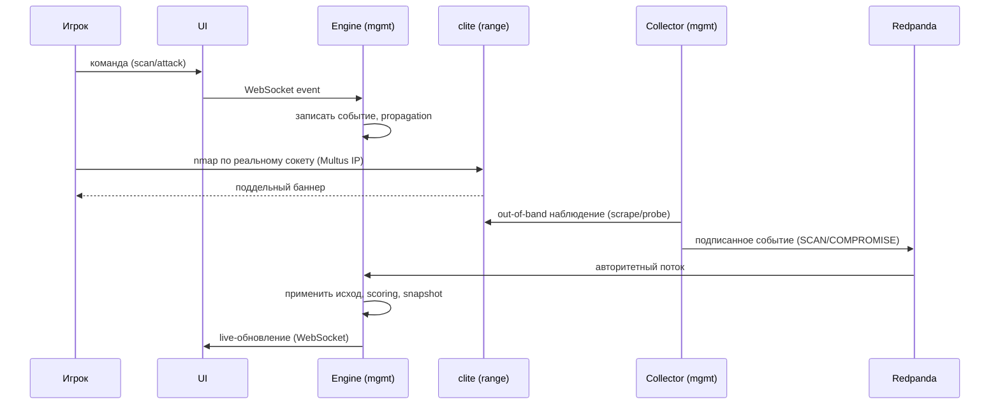
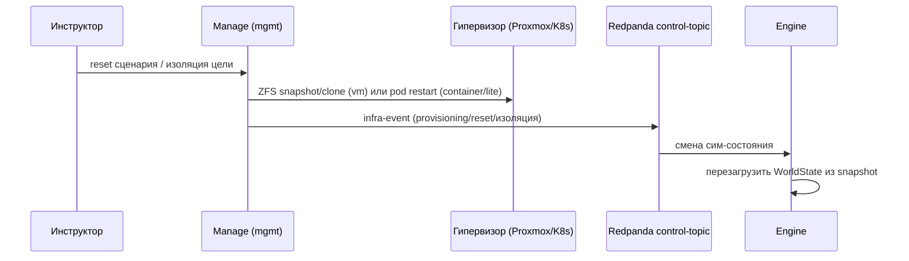

# CyberCity — Data Flow (runtime-динамика)

Как система ведёт себя во времени: как рождается и применяется событие, как
проходит сценарий от авторинга до отчёта, какие end-to-end потоки возникают.
Статика (компоненты, сетевая топология, два графа) — в
[`ARCHITECTURE.md`](ARCHITECTURE.md); состав и контракты артефактов — в
[`COMPOSITION.md`](COMPOSITION.md); форма event envelope — в
[`CONVENTIONS.md`](CONVENTIONS.md) (§ «Event envelope»). Здесь — только
динамический вид (process + use-case из 4+1).

> Описано целевое runtime-поведение. Текущая степень реализации — в
> [`COMPOSITION.md`](COMPOSITION.md) (§ «Статус реализации»).

## Жизненный цикл события

Состояние города — проекция потока событий (принцип «события — единственный
источник истины», см. [`VISION.md`](VISION.md)). Одно событие проходит:

1. **Рождение** — `source_type` ∈ `player | collector | scenario | system |
   service | engine`. Источники: команда игрока (через UI), наблюдение
   коллектора (out-of-band, подписанное), inject сценария, системное событие
   (provisioning/reset от manage), ответ сервиса.
2. **Ingestion** — `engine` принимает: подписанные события коллектора — из
   Redpanda (consumer-loop); команды/инфра-события — через control API и
   control-topic от `manage`; события игрока/сценария — через API/WebSocket.
3. **Валидация** — `engine` проверяет событие против схемы и текущего
   `WorldState`; неподписанные/невалидные — отбрасываются или помечаются
   `status: failed/suppressed`.
4. **Применение** — `engine` — **единственный мутатор** (см.
   [`COMPOSITION.md`](COMPOSITION.md) § «Кто чем владеет»): событие меняет
   `WorldState`, пишется в событийный граф (append-only) с рёбрами `caused_by`,
   `propagated_to`, `triggered_rule`, `response_to`.
5. **Propagation** — исход распространяется по топологическому графу (по
   декларированным и inferred рёбрам — `api-call`, `auth`, `same_network`,
   `exposure_chain`, …), порождая производные события/состояния.
6. **Scoring** — считается на **доверенном** потоке (collector + system), не на
   in-guest best-effort (ADR-0002). Scoring-rubric сценария отображает события
   в очки/флаги.
7. **Persistence** — событие в audit-log (событийный граф) + периодические
   снапшоты `WorldState` в PostgreSQL (только `engine`).

Форма события (поля `event_id`, `parent_event_ids`, `correlation_id`, `tick`,
`source_type`, …) — в [`CONVENTIONS.md`](CONVENTIONS.md) § «Event envelope»;
события коллектора дополнительно в подписанном Ed25519 конверте.

## Жизненный цикл сценария

End-to-end путь учения от авторинга до отчёта:

1. **Авторинг** — сценарий (цели, injects, флаги, scoring-rubric, timebox)
   авторится в `cybercity-data` как декларация (контракт **data → engine**).
2. **Build** — `cybercity-data build` → `engine.zip` (`engine.json`,
   `topology.json`, `attack-surface.json`, `schema.json`) + артефакт сценария.
3. **Provisioning** — `cybercity-manage` разворачивает runtime-цели по
   service-mapping manifest (`service_id → {runtime_kind, template}`):
   `vm` (ZFS clone), `container`, `lite` (stub-под `clite`). По умолчанию
   `runtime_kind: lite` (ADR-0004).
4. **Load & start** — `engine` грузит `engine.zip`, строит топологический граф,
   стартует сценарий (tick-loop, injects по расписанию).
5. **Наблюдение** — `cybercity-collector` per-host наблюдает цели out-of-band →
   подписанные события в Redpanda → `engine` как авторитетный поток.
6. **Исполнение** — игроки действуют через UI; их команды и наблюдения
   коллектора текут через движок (см. «Жизненный цикл события»); state и
   событийный граф растут.
7. **Scoring** — по rubric на доверенном потоке; флаги/компрометации/время.
8. **Timebox / end** — сценарий заканчивается по таймбоксу или условию;
   финальный снапшот `WorldState` + audit-log.
9. **Replay / отчёт** — детерминированный replay из audit-log; отчёты red/blue
   в `cybercity-ui`.

## End-to-end потоки

### Игрок атакует `lite`-сервис

Ключевое: исход (scan/compromise) приходит в `engine` **только** как подписанное
событие от коллектора — движок его не выдумывает (ADR-0004: регистратор, не
симулятор). Игрок бьёт по реальному сокету `clite` (range); коллектор видит
это снаружи и сообщает. UI отражает смену состояния live.

### Reset / изоляция цели

Действие над гостем идёт через `manage`/фабрику из mgmt-сегмента, **не** через
in-guest агент (ADR-0002/0003); `engine` только слышит об этом как о смене
сим-состояния через control-topic.

## Replay и scoring

- **Replay** — повторное применение доверенного потока событий из audit-log:
  детерминированный режим (фиксированный порядок, воспроизводимое `--seed` в
  `data`), даёт what-if и разбор инцидента. In-guest best-effort в replay не
  участвует.
- **Scoring** — вычисляется на доверенной плоскости (collector + system
  события) по rubric сценария; in-guest телеметрия **никогда** не источник для
  scoring (ADR-0002). Атакующий в range не может подделать поток — у него нет
  маршрута в брокер и нельзя подписать событие ключом коллектора.

## Связанные документы

- [`ARCHITECTURE.md`](ARCHITECTURE.md) — статика: компоненты, сетевая топология
  и сегментация, два графа, hybrid execution.
- [`COMPOSITION.md`](COMPOSITION.md) — состав, артефактные потоки и контракты,
  доверительная граница, ownership.
- [`CONVENTIONS.md`](CONVENTIONS.md) — форма event envelope, логирование.
- [`adr/`](adr/) — обоснования (0002 доверительная граница, 0003 out-of-band
  коллектор, 0004 runtime_kind / движок-регистратор).