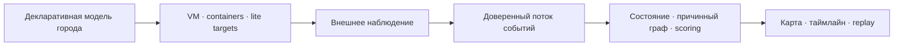

# CyberCity

[](https://github.com/TheCipherKeeper/cybercity/actions/workflows/verify.yml)
[](LICENSE)
[](LICENSE-DOCS)

**Киберполигон в форме живого цифрового города.**

CyberCity моделирует городскую ИТ/ОТ-инфраструктуру как ориентированный граф:
организации владеют сервисами, сетевые связи определяют достижимость, а каждое
изменение состояния сохраняет наблюдаемую причину. Сценарий можно запустить,
атаку — проследить, последствия — воспроизвести и разобрать.

Проект рассчитан на red/blue-учения, исследование каскадных инфраструктурных
рисков и практику построения наблюдаемых event-driven систем. Развёртывание
ориентировано на собственную инфраструктуру — Proxmox и Kubernetes, без
обязательного SaaS и внешней телеметрии.

> **Статус:** активная разработка до первой публичной демонстрации. Ядро графа и
> событий уже существует, остальные компоненты находятся на разных стадиях.
> Актуальные сведения — в
> [дорожной карте и статусе реализации](COMPOSITION.md#дорожная-карта-к-первой-публичной-демонстрации).

## Зачем CyberCity

Обычный учебный стенд часто показывает только итог: сервис доступен или
скомпрометирован. CyberCity строится вокруг причинной истории:

- топология определяет, куда атакующий действительно может добраться;
- внешнее наблюдение фиксирует произошедшее, а не предполагаемое;
- поток событий объясняет каждый переход состояния;
- replay позволяет восстановить ход учения и разобрать решения команд;
- scoring опирается на доверенные наблюдения, а не на данные из
  скомпрометированного гостя.

## Как это работает



Это обзор потока, а не контракт между компонентами. Канонические границы,
владение данными, репозитории и связи находятся в
[`COMPOSITION.md`](COMPOSITION.md), формат событий — в
[`CONVENTIONS.md`](CONVENTIONS.md).

## Что находится в этом репозитории

Этот репозиторий — **хаб программы**, а не монорепозиторий с кодом сервисов.

| Документ | Назначение |
|---|---|
| [`COMPOSITION.md`](COMPOSITION.md) | Канонический состав системы, границы, ownership, потоки, roadmap и статус |
| [`CONVENTIONS.md`](CONVENTIONS.md) | Версионируемый event envelope и общие правила взаимодействия |
| [`adr/`](adr/) | Архитектурные решения всей программы |
| [`docker-compose.yml`](docker-compose.yml) | Системная композиция компонентов |
| [`BACKLOG.md`](BACKLOG.md) | Единственный упорядоченный источник задач |
| [`AGENTS.md`](AGENTS.md) | Правила работы людей и программных агентов |

Код каждого компонента развивается в отдельном репозитории. Их полный перечень,
роли, стеки и текущая готовность поддерживаются только в
[`COMPOSITION.md`](COMPOSITION.md), чтобы не дублировать системные факты.

## Быстрый старт

Для системного запуска нужны Docker Compose и заранее опубликованные образы
компонентов.

```bash
git clone https://github.com/TheCipherKeeper/cybercity.git
cd cybercity

cp .env.example .env
docker compose config
docker compose up -d
docker compose ps
```

Интерфейс и API при наличии соответствующих образов доступны на портах,
заданных в [`docker-compose.yml`](docker-compose.yml). Поскольку проект ещё
развивается, совместимость всей композиции проверяйте по
[текущему статусу](COMPOSITION.md#статус-реализации-кратко). Локальная сборка и
запуск отдельного компонента описываются в его собственном репозитории.

## Участие в разработке

Работа начинается с первой задачи `[ ] ready` в
[`BACKLOG.md`](BACKLOG.md) и ведётся в ветке
`feat/TASK-NNNN-<slug>`. Изменения попадают в `main` только через PR,
обязательную проверку и squash merge.

```bash
git switch main
git pull --ff-only
git switch -c feat/TASK-NNNN-short-description
```

Перед изменениями прочитайте [`AGENTS.md`](AGENTS.md). Методология разработки
закреплена точной версией в [`.methodology.yml`](.methodology.yml), поэтому
локальная проверка и CI используют один набор правил.

## Документация

- [Состав и архитектура системы](COMPOSITION.md)
- [Контракты взаимодействия](CONVENTIONS.md)
- [Архитектурные решения](adr/README.md)
- [Бэклог](BACKLOG.md)
- [Правила работы](AGENTS.md)
- [Методология проекта](https://github.com/TheCipherKeeper/ai-project-template)

## Лицензии

Код распространяется по [MIT](LICENSE), документация — по
[CC BY 4.0](LICENSE-DOCS).
