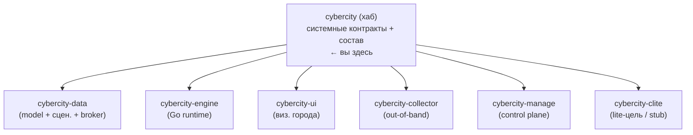

# CyberCity

[](#)
[](LICENSE)
[](LICENSE-DOCS)

**CyberCity** — модульный кибер-полигон: цифровой двойник городской ИТ/ОТ-
инфраструктуры для учений red/blue. Город моделируется как ориентированный граф
(организации → сервисы → связи достижимости), декларируется как код, рендерится
в артефакты, исполняется runtime. Не очередная CTF-машинка, а живой, наблюдаемый,
объяснимый город, где инциденты распространяются через достижимость (каждое
падение — наблюдённое коллектором событие). Всё крутится на вашем Proxmox / K8s,
без SaaS и внешней телеметрии.

Этот репозиторий — **хаб** программы: системные контракты и состав. Кода здесь
нет. Реализация каждого слоя — в отдельном репозитории (`cybercity-*`).
Методология построения — в
[`TheCipherKeeper/ai-project-template`](https://github.com/TheCipherKeeper/ai-project-template).

## Что в хабе

| Файл | Что |
|---|---|
| [`COMPOSITION.md`](COMPOSITION.md) | Состав программы: сервисы + интерфейсы + stub-таргеты, контракты, доверительная граница, ownership, потоки, статус реализации. Edge-реестр для verification «вниз». |
| [`CONVENTIONS.md`](CONVENTIONS.md) | Event envelope и кросс-сервисные конвенции общения (версионируется `CONVENTIONS@vN`). |
| [`AGENTS.md`](AGENTS.md) | Правила работы в хабе: приоритет доков, ветвление, можно/нельзя, версионирование контрактов, ADR-формат, нейминг, коммиты. |
| [`docker-compose.yml`](docker-compose.yml) | Системный compose: все сервисы + брокер (Redpanda). |
| [`adr/`](adr/) | Архитектурные решения (единый ADR-дом программы; индекс — `adr/README.md`). |

## Репозитории программы

| | Репозиторий | Роль | Стек |
|---|---|---|---|
| 🎯 | **[cybercity](https://github.com/TheCipherKeeper/cybercity)** | Хаб: системные контракты, состав, ADR (этот репо) | — |
| 🗺️ | [cybercity-data](https://github.com/TheCipherKeeper/cybercity-data) | Декларативная модель города + авторинг сценариев + уязвимости; broker-участник (`city.build.completed`) | Python |
| ⚙️ | [cybercity-engine](https://github.com/TheCipherKeeper/cybercity-engine) | Событийное ядро: топологический + причинный граф, tick-loop, replay, scoring; единственный мутатор | Go |
| 🏗️ | [cybercity-manage](https://github.com/TheCipherKeeper/cybercity-manage) | Контрольная плоскость: provisioning, reset/изоляция, квоты; оркестрирует Proxmox + IaC | Go |
| 📡 | [cybercity-collector](https://github.com/TheCipherKeeper/cybercity-collector) | Внешний out-of-band per-host коллектор; подписанные события в engine | Rust |
| 🧩 | [cybercity-clite](https://github.com/TheCipherKeeper/cybercity-clite) | Stub-образ `clite` для `runtime_kind: lite` (passive target) | Rust |
| 🖥️ | [cybercity-ui](https://github.com/TheCipherKeeper/cybercity-ui) | 2D-карта, таймлайн, дашборды red/blue | TS |

Канон состава, контрактов, пинов и доверительной границы — в
[`COMPOSITION.md`](COMPOSITION.md). Выше — короткая карта для ориентирования.

## Навигация по слоям



Профиль автора: [`TheCipherKeeper`](https://github.com/TheCipherKeeper/TheCipherKeeper) · [thecipherkeeper.github.io](https://thecipherkeeper.github.io).

## Разработка

```bash
git checkout main && git pull && git checkout -b feat/<задача>
# правки COMPOSITION/CONVENTIONS/compose/adr; проверка перед коммитом
git commit -m "feat(conventions): ..." && git push   # PR в main
```

Прямой коммит в `main` запрещён; интеграция — только PR. Стабильные версии —
тегами `vX.Y.Z` на `main`. Правила — [`AGENTS.md`](AGENTS.md).

### Запуск всей программы

```bash
cp .env.example .env            # заполнить per-сервис конф + BROKER_ADDR + CONVENTIONS_PIN
docker compose config           # проверить
docker compose up               # брокер + все сервисы (образы собраны заранее)
```

Команды запуска/сборки отдельного сервиса — в его репозитории (там код и
`Dockerfile`); в хабе их нет. Структура compose —
[`ai-project-template/docs/refs/DEPLOYMENT.md`](https://github.com/TheCipherKeeper/ai-project-template/blob/main/docs/refs/DEPLOYMENT.md).

## Лицензия

Код — [MIT](LICENSE), документация — [CC BY 4.0](LICENSE-DOCS). Полное правило о
лицензиях в каждом репозитории — [`AGENTS.md`](AGENTS.md) → *Лицензии*.